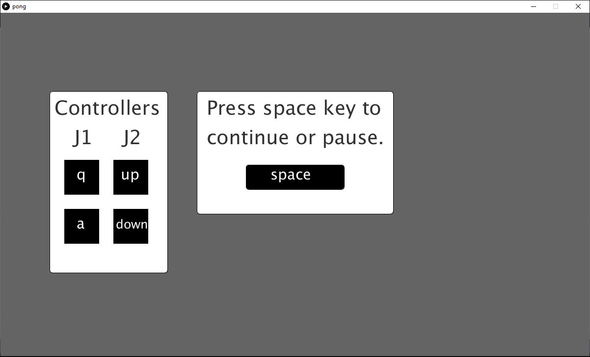
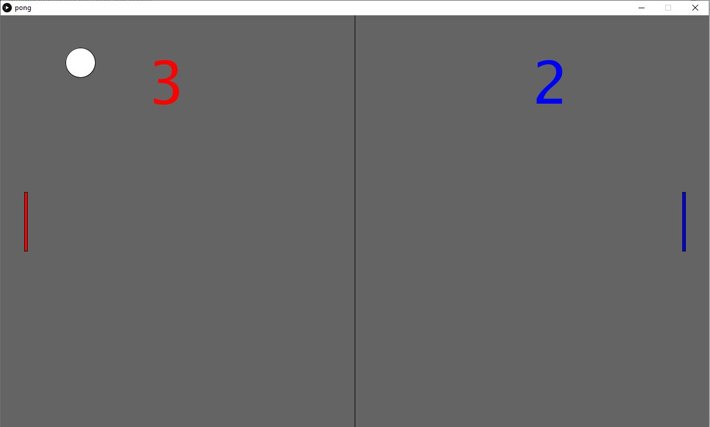
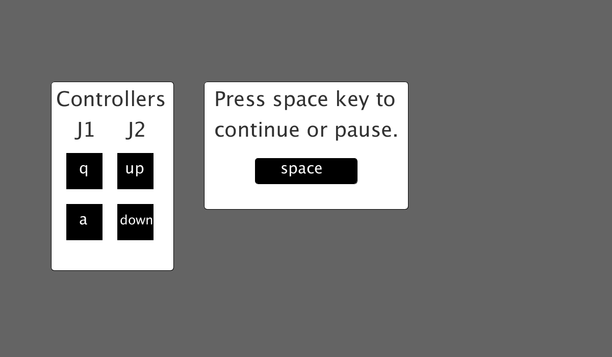
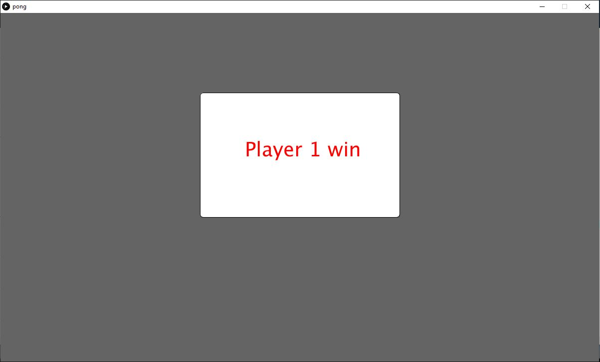

# Pong_videogame
Pong videogame developed on Processing(Java)

<!-- PROJECT LOGO -->
 

  

  <h3 align="center">Videojuego Pong</h3>

  

    ¡Videojuego PONG desarrollado en Processing3!
     
      <a href="https://github.com/carlosepb/Pong_videogame"><strong>Explorar repositorio»</strong></a>
     
     
      <a href="https://github.com/carlosepb/Pong_videogame/blob/main/images/animation_pong.gif">Ver Demo</a>
      ·
      <a href="https://github.com/carlosepb/Pong_videogame/issues">Reportar Error</a>
      ·
      <a href="https://github.com/carlosepb/Pong_videogame/issues">Solicitar Colaboración</a>
    

  

<!-- TABLE OF CONTENTS -->

  
Tabla de Contenido

  <ol>
    <li>
      <a href="#sobre-el-proyecto">Sobre el Proyecto</a>
      <ul>
        <li><a href="#herramientas-de-desarrollo">Herramientas de Desarrollo</a></li>
      </ul>
    </li>
    <li><a href="#trabajo-realizado">Trabajo Realizado</a></li>
    <li>
      <a href="#empezando">Empezando</a>
      <ul>
        <li><a href="#prerrequisitos">Prerrequisitos</a></li>
        <li><a href="#instalación">Instalación</a></li>
        <li><a href="#ejecutar">Ejecutar</a></li>
      </ul>
    </li>
    <li><a href="#hoja-de-ruta">Hoja de Ruta</a></li>
    <li><a href="#licencia">Licencia</a></li>
    <li><a href="#contacto">Contacto</a></li>
    <li><a href="#agradecimientos">Agradecimientos</a></li>
  </ol>

<!-- ABOUT THE PROJECT -->
## Sobre el Proyecto

Se trata del desarrollo del videojuego PONG para dos jugadores, el jugador de la izquierda se desplazará utilizando las teclas “q” para subir y “a” para bajar (en minúscula siempre) y el jugador de la derecha hará lo propio utilizando la flecha arriba y la flecha abajo. Para pausar el juego o empezar se utilizará la tecla espacio (imagen_1.0).

 imagen_1.0(Pause)

El juego cuenta con dos marcadores que se incrementarán al marcar un gol al jugador contrarío. Al encajar un gol el balón volverá al centro saliendo impulsado hacia el jugador que acaba de marcar un gol (imagen_2.0).

 imagen_2.0(Jugando)

El saque inicial será siempre hacia el jugador de la derecha llevando una trayectoria y velocidad aleatoria siendo siempre una que no impida que el jugador pueda devolver la pelota, la cual incrementará su velocidad en cada remate (imagen_3.0).

 imagen_3.0(Saque)

El juego termina cuando uno de los jugadores llega a 5 puntos.

 imagen_4.0(Victoria)

## Trabajo Realizado

En la primera pantalla que servirá también como pantalla de pausa veremos los controles generales del juego, esto es así para aprovechar la pausa como menú de instrucciones.

Los elementos en pantalla como las palas o la pelota se han definido utilizando un grupo de variables de tipo entero que definen su posición, tamaño y zonas de colisión.

Para los movimientos de las palas se han utilizado los eventos de tecla pulsada y liberada para evitar la colisión de eventos al definirlos de manera lineal en el bucle principal, lo cual producía que uno de los jugadores pudiese bloquear al otro al no dejar de moverse.

Cada jugador y su marcador aparecerá en un color distinto y cuando alguno llega a 5 goles vera un mensaje de victoria con su nombre y color.

Se han añadido 3 sonidos distintos para los distintos puntos de colisión de la pelota (campo, raqueta o línea de gol).

La grabación de gif está disponible pero para una ejecución mas optima se encuentra comentada en el código, en caso de querer usarla descomentar las líneas 43, 44, 222 y 276. Para parar la grabación haremos un clic sobre la pantalla ya que esta se encuentra en un evento de ratón pulsado.

## Herramientas de Desarrollo

* [Processing3](https://processing.org/download/)

<!-- GETTING STARTED -->
## Empezando

Para modificar la aplicación necesitará instalar el entorno de desarrollo Processing3 y las herramientas Sound y GifAnimation. En caso de que solo quiera ejecutar la versión release no será necesario que instale nada y puede pasar directamente al paso Ejecutar->Release.

### Prerrequisitos

* Descargar y descomprimir Processing3, lo puedes encontrar [aquí](https://processing.org/download/).

### Instalación

1. Instalar la biblioteca de sonido de la Processing Foundation desde el IDE Processing3.
    * Herramientas->Añadir herramientas.
    * Buscar Sound en la pestaña Libraries.
    * Install.
2. Para exportar a un archivo con formato gif animado es necesario instalar GifAnimation, lo puede encontrar [aquí](https://github.com/extrapixel/gif-animation).
   
### Ejecutar

1. Release.
    * Descomprimir rar.
    * Entrar a la versión correspondiente a nuestro windows.
    * Lanzar pong.exe.
2. Proyecto.
    * Descomprimir rar.
    * Ejecutar Processin3.
    * Archivo->Abrir...

<!-- ROADMAP -->
## Hoja de Ruta

Planes para la versión 0.2:

* Mejorar sistema de colisiones de la pelota con las raquetas.
* Añadir celebración de gol al anotar un gol.
* Añadir mensaje dinámico de celebración al llegar un jugador a los 5 goles.
* Mejoras de estabilidad.

Planes para la versión 0.3:

* Ajustar tamaño de pelota.
* Cambiar colores de los jugadores.
* Añadir nuevas pistas de juego.

<!-- LICENSE -->
## Licencia

Software completamente libre para copiar o distribuir.

<!-- CONTACT -->
## Contacto

Autor: Carlos Eduardo Pacichana Bastidas

Email: carlos.eduardo.pacichana@gmail.com  carlos.pacichana101@alu.ulpgc.es

Enlace al proyecto: [https://github.com/carlosepb/Pong_videogame](https://github.com/carlosepb/Pong_videogame)

<!-- ACKNOWLEDGEMENTS -->
## Agradecimientos
* [Processing](https://processing.org/)
* [Freewavesamples](https://freewavesamples.com/)
* [Gif-animation](https://github.com/extrapixel/gif-animation)
* [Funprogramming](https://funprogramming.org/)
* [Text](https://processing.org/reference/text_.html)
