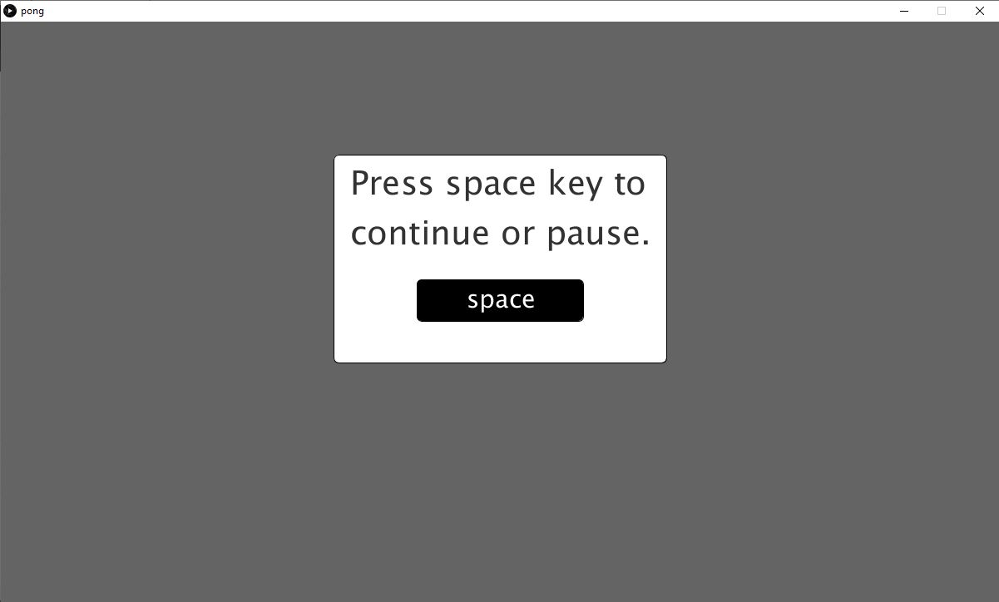
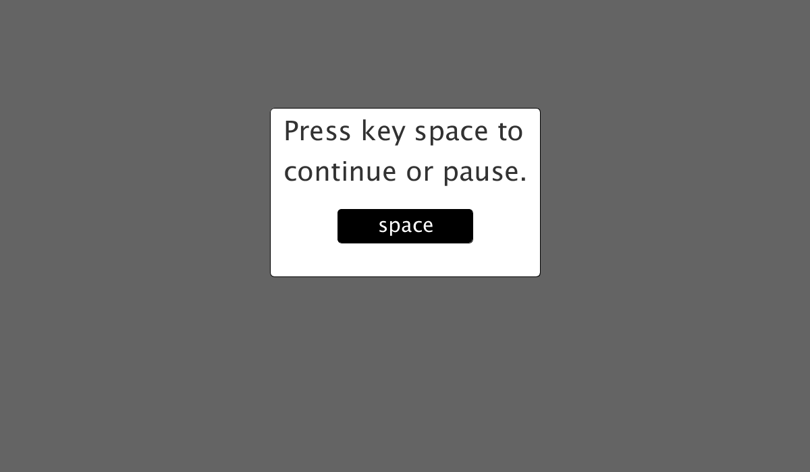

# Pong_videogame
Pong videogame developed on Processing(Java)

<!-- PROJECT LOGO -->
 

  

  <h3 align="center">Videojuego Pong</h3>

  

    ¡Videojuego PONG desarrollado en Processing3!
     
      <a href="https://github.com/carlosepb/Pong_videogame"><strong>Explorar repositorio»</strong></a>
     
     
      <a href="https://github.com/carlosepb/Pong_videogame/blob/main/images/animation.gif">Ver Demo</a>
      ·
      <a href="https://github.com/carlosepb/Pong_videogame/issues">Reportar Error</a>
      ·
      <a href="https://github.com/carlosepb/Pong_videogame/issues">Solicitar Colaboración</a>
    

  

<!-- TABLE OF CONTENTS -->

  
Tabla de Contenido

  <ol>
    <li>
      <a href="#sobre-el-proyecto">Sobre el Proyecto</a>
      <ul>
        <li><a href="#herramientas-de-desarrollo">Herramientas de Desarrollo</a></li>
      </ul>
    </li>
    <li>
      <a href="#empezando">Empezando</a>
      <ul>
        <li><a href="#prerrequisitos">Prerrequisitos</a></li>
        <li><a href="#instalación">Instalación</a></li>
      </ul>
    </li>
    <li><a href="#hoja-de-ruta">Hoja de Ruta</a></li>
    <li><a href="#licencia">Licencia</a></li>
    <li><a href="#contacto">Contacto</a></li>
    <li><a href="#agradecimientos">Agradecimientos</a></li>
  </ol>

<!-- ABOUT THE PROJECT -->
## Sobre el Proyecto

Se trata del desarrollo del videojuego PONG para dos jugadores, el jugador de la izquierda se desplazará utilizando las teclas “q” para subir y “a” para bajar (en minúscula siempre) y el jugador de la derecha hará lo propio utilizando la flecha arriba y la flecha abajo. Para pausar el juego o empezar se utilizará la tecla espacio (imagen_1.0).

 imagen_1.0(Pause)

El juego cuenta con dos marcadores que se incrementarán al marcar un gol al jugador contrarío. Al encajar un gol el balón volverá al centro saliendo impulsado hacia el jugador que acaba de marcar un gol (imagen_2.0).

 imagen_2.0(Jugando)

El saque inicial será siempre hacia el jugador de la derecha llevando una trayectoria y velocidad aleatoria siendo siempre una que no impida que el jugador pueda devolver la pelota, la cual incrementará su velocidad en cada remate (imagen_3.0).

 imagen_3.0(Saque)

El juego termina cuando uno de los jugadores llega a 10 puntos.

### Herramientas de Desarrollo

* [Processing3](https://processing.org/download/)

<!-- GETTING STARTED -->
## Empezando

Para modificar la aplicación necesitarás instalar el entorno de desarrollo Processing3 y las herramientas Sound y GifAnimation.

### Prerrequisitos

* Descargar y descomprimir Processing3, lo puedes encontrar [aquí](https://processing.org/download/)

### Instalación

1. Instalar previamente la biblioteca de sonido de la Processing Foundation
    * Herramientas->Añadir herramientas
    * Buscar Sound en la pestaña Libraries.
    * Install
2.  exportar a un archivo con formato gif animado, es necesario instalar GifAnimation a través https://github.com/extrapixel/gif-animation
   

<!-- ROADMAP -->
## Hoja de Ruta

Planes para la versión 0.2:

* Mejorar sistema de colisiones de la pelota con las raquetas.
* Añadir celebración de gol al anotar un gol.
* Añadir mensaje de celebración al llegar un jugador a los 10 goles.
* Mejoras de estabilidad.

Planes para la versión 0.3:

* Ajustar tamaño de pelota.
* Cambiar colores de los jugadores.
* Añadir nuevas pistas de juego.

<!-- LICENSE -->
## Licencia

Software completamente libre para copiar o distribuir.

<!-- CONTACT -->
## Contacto

Carlos Eduardo Pacichana Bastidas - carlos.eduardo.pacichana@gmail.com  carlos.pacichana101@alu.ulpgc.es

Enlace al proyecto: [https://github.com/carlosepb/Pong_videogame](https://github.com/carlosepb/Pong_videogame)

<!-- ACKNOWLEDGEMENTS -->
## Agradecimientos
* [GitHub Emoji Cheat Sheet](https://www.webpagefx.com/tools/emoji-cheat-sheet)
* [Img Shields](https://shields.io)
* [Choose an Open Source License](https://choosealicense.com)
* [GitHub Pages](https://pages.github.com)
* [Animate.css](https://daneden.github.io/animate.css)
* [Loaders.css](https://connoratherton.com/loaders)
* [Slick Carousel](https://kenwheeler.github.io/slick)
* [Smooth Scroll](https://github.com/cferdinandi/smooth-scroll)
* [Sticky Kit](http://leafo.net/sticky-kit)
* [JVectorMap](http://jvectormap.com)
* [Font Awesome](https://fontawesome.com)

<!-- MARKDOWN LINKS & IMAGES -->
<!-- https://www.markdownguide.org/basic-syntax/#reference-style-links -->
[contributors-shield]: https://img.shields.io/github/contributors/othneildrew/Best-README-Template.svg?style=for-the-badge
[contributors-url]: https://github.com/othneildrew/Best-README-Template/graphs/contributors
[forks-shield]: https://img.shields.io/github/forks/othneildrew/Best-README-Template.svg?style=for-the-badge
[forks-url]: https://github.com/othneildrew/Best-README-Template/network/members
[stars-shield]: https://img.shields.io/github/stars/othneildrew/Best-README-Template.svg?style=for-the-badge
[stars-url]: https://github.com/othneildrew/Best-README-Template/stargazers
[issues-shield]: https://img.shields.io/github/issues/othneildrew/Best-README-Template.svg?style=for-the-badge
[issues-url]: https://github.com/othneildrew/Best-README-Template/issues
[license-shield]: https://img.shields.io/github/license/othneildrew/Best-README-Template.svg?style=for-the-badge
[license-url]: https://github.com/othneildrew/Best-README-Template/blob/master/LICENSE.txt
[linkedin-shield]: https://img.shields.io/badge/-LinkedIn-black.svg?style=for-the-badge&logo=linkedin&colorB=555
[linkedin-url]: https://linkedin.com/in/othneildrew
[product-screenshot]: images/screenshot.png
