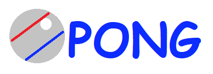

# Pong_videogame
Pong videogame developed on Processing(Java)

<!-- PROJECT LOGO -->
<br />
<p align="center">
  <a href="https://github.com/carlosepb/Pong_videogame">
    
  </a>

  <h3 align="center">Videojuego Pong</h3>

  <p align="center">
    ¡Videojuego PONG desarrollado en Processing3!
    <br />
      <a href="https://github.com/carlosepb/Pong_videogame"><strong>Explorar repositorio»</strong></a>
    <br />
    <br />
      <a href="https://github.com/carlosepb/Pong_videogame/blob/main/images/animation.gif">Ver Demo</a>
      ·
      <a href="https://github.com/carlosepb/Pong_videogame/issues">Reportar Error</a>
      ·
      <a href="https://github.com/carlosepb/Pong_videogame/issues">Solicitar Colaboración</a>
    </p>
  </p>


<!-- TABLE OF CONTENTS -->
<details open="open">
  <summary>Tabla de Contenido</summary>
  <ol>
    <li>
      <a href="#sobre-el-proyecto">Sobre el Proyecto</a>
      <ul>
        <li><a href="#herramientas-de-desarrollo">Herramientas de Desarrollo</a></li>
      </ul>
    </li>
    <li>
      <a href="#empezando">Empezando</a>
      <ul>
        <li><a href="#prerequisites">prerrequisito</a></li>
        <li><a href="#instalación">Instalación</a></li>
      </ul>
    </li>
    <li><a href="#usage">Uso</a></li>
    <li><a href="#roadmap">Hoja de Ruta</a></li>
    <li><a href="#contributing">Contribuir</a></li>
    <li><a href="#license">Licencia</a></li>
    <li><a href="#contact">Contacto</a></li>
    <li><a href="#acknowledgements">Agradecimientos</a></li>
  </ol>
</details>


<!-- ABOUT THE PROJECT -->
## Sobre el Proyecto

Se trata del desarrollo del videojuego PONG para dos jugadores, el jugador de la izquierda se desplazará utilizando las teclas “q” para subir y “a” para bajar (en minúscula siempre) y el jugador de la derecha hará lo propio utilizando la flecha arriba y la flecha abajo. Para pausar el juego o empezar se utilizará la tecla espacio (imagen_1.0).

<p align="center"></br>imagen_1.0(Pause)</p>

El juego cuenta con dos marcadores que se incrementarán al marcar un gol al jugador contrarío. Al encajar un gol el balón volverá al centro saliendo impulsado hacia el jugador que acaba de marcar un gol (imagen_2.0).

<p align="center"></br>imagen_2.0(Jugando)</p>

El saque inicial será siempre hacia el jugador de la derecha llevando una trayectoria y velocidad aleatoria siendo siempre una que no impida que el jugador pueda devolver la pelota, la cual incrementará su velocidad en cada remate (imagen_3.0).

<p align="center"></br>imagen_3.0(Saque)</p>

El juego termina cuando uno de los jugadores llega a 10 puntos.

### Herramientas de Desarrollo

* [Processing3](https://processing.org/download/)

<!-- GETTING STARTED -->
## Empezando

Para modificar la aplicación necesitarás instalar el entorno de desarrollo Processing3 y las herramientas Sound y GifAnimation.

### Prerequisites

This is an example of how to list things you need to use the software and how to install them.
* Processing3
  ```sh
  npm install npm@latest -g
  ```

### Instalación

1. Get a free API Key at [https://example.com](https://example.com)
2. Clone the repo
   ```sh
   git clone https://github.com/your_username_/Project-Name.git
   ```
3. Install NPM packages
   ```sh
   npm install
   ```
4. Enter your API in `config.js`
   ```JS
   const API_KEY = 'ENTER YOUR API';
   ```


<!-- USAGE EXAMPLES -->
## Usage

Use this space to show useful examples of how a project can be used. Additional screenshots, code examples and demos work well in this space. You may also link to more resources.

_For more examples, please refer to the [Documentation](https://example.com)_


<!-- ROADMAP -->
## Roadmap

See the [open issues](https://github.com/othneildrew/Best-README-Template/issues) for a list of proposed features (and known issues).


<!-- CONTRIBUTING -->
## Contributing

Contributions are what make the open source community such an amazing place to be learn, inspire, and create. Any contributions you make are **greatly appreciated**.

1. Fork the Project
2. Create your Feature Branch (`git checkout -b feature/AmazingFeature`)
3. Commit your Changes (`git commit -m 'Add some AmazingFeature'`)
4. Push to the Branch (`git push origin feature/AmazingFeature`)
5. Open a Pull Request


<!-- LICENSE -->
## License

Distributed under the MIT License. See `LICENSE` for more information.


<!-- CONTACT -->
## Contact

Your Name - [@your_twitter](https://twitter.com/your_username) - email@example.com

Project Link: [https://github.com/your_username/repo_name](https://github.com/your_username/repo_name)


<!-- ACKNOWLEDGEMENTS -->
## Acknowledgements
* [GitHub Emoji Cheat Sheet](https://www.webpagefx.com/tools/emoji-cheat-sheet)
* [Img Shields](https://shields.io)
* [Choose an Open Source License](https://choosealicense.com)
* [GitHub Pages](https://pages.github.com)
* [Animate.css](https://daneden.github.io/animate.css)
* [Loaders.css](https://connoratherton.com/loaders)
* [Slick Carousel](https://kenwheeler.github.io/slick)
* [Smooth Scroll](https://github.com/cferdinandi/smooth-scroll)
* [Sticky Kit](http://leafo.net/sticky-kit)
* [JVectorMap](http://jvectormap.com)
* [Font Awesome](https://fontawesome.com)


<!-- MARKDOWN LINKS & IMAGES -->
<!-- https://www.markdownguide.org/basic-syntax/#reference-style-links -->
[contributors-shield]: https://img.shields.io/github/contributors/othneildrew/Best-README-Template.svg?style=for-the-badge
[contributors-url]: https://github.com/othneildrew/Best-README-Template/graphs/contributors
[forks-shield]: https://img.shields.io/github/forks/othneildrew/Best-README-Template.svg?style=for-the-badge
[forks-url]: https://github.com/othneildrew/Best-README-Template/network/members
[stars-shield]: https://img.shields.io/github/stars/othneildrew/Best-README-Template.svg?style=for-the-badge
[stars-url]: https://github.com/othneildrew/Best-README-Template/stargazers
[issues-shield]: https://img.shields.io/github/issues/othneildrew/Best-README-Template.svg?style=for-the-badge
[issues-url]: https://github.com/othneildrew/Best-README-Template/issues
[license-shield]: https://img.shields.io/github/license/othneildrew/Best-README-Template.svg?style=for-the-badge
[license-url]: https://github.com/othneildrew/Best-README-Template/blob/master/LICENSE.txt
[linkedin-shield]: https://img.shields.io/badge/-LinkedIn-black.svg?style=for-the-badge&logo=linkedin&colorB=555
[linkedin-url]: https://linkedin.com/in/othneildrew
[product-screenshot]: images/screenshot.png
